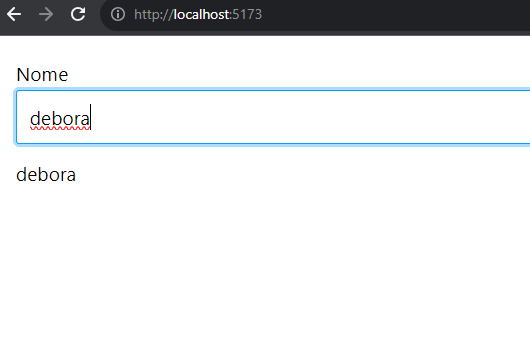
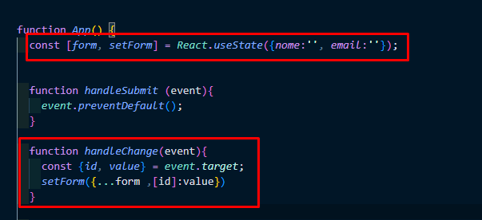
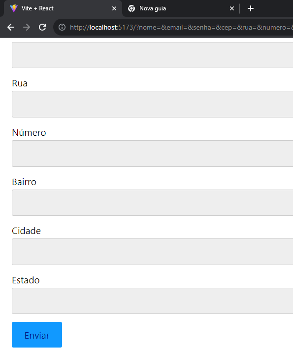
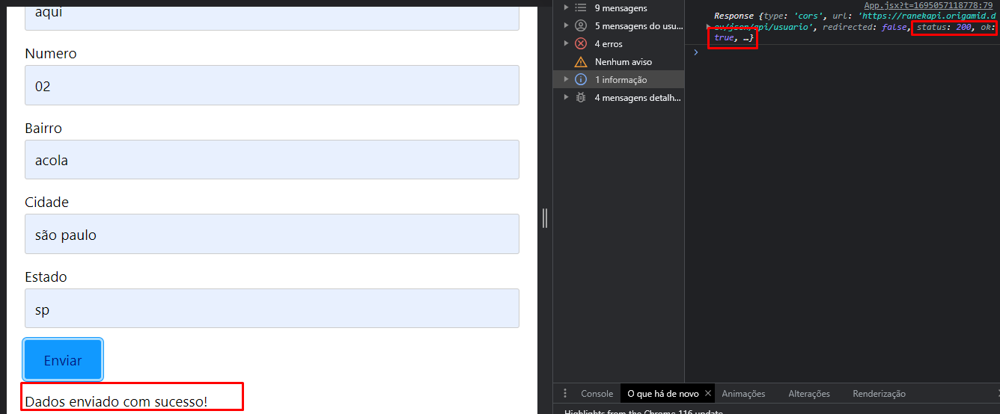

# React + Vite

# Reatividade
Para criarmos campos de formulário reativos, devemos definir o estado para o value e a função atualizadora para o onchange.

# Multiplos Valores
Voce pode usar um novo useState para cada campo ou usar um objeto.

#Objeto
Poderiamos utilizar um objeto e passar todos os campos do forumlario fazendo um unico estado e sua função modificadora.

# Exercicio

// Faça um fetch (POST) para a API abaixo
// Para a criação ser aceita é necessário enviar dodos de:
// nome, email, senha, cep, rua, numero, bairro, cidade e estado

// Essa é a função utilizado para realizar o POST
/*fetch('https://ranekapi.origamid.dev/json/api/usuario', {
  method: 'POST',
  headers: {
    'Content-Type': 'application/json',
  },
  // form é o objeto com os dados do formulário
  body: JSON.stringify(form),
});*/

// Mostre uma mensagem na tela, caso a resposta da API seja positiva

## tela com os campos sem o fetch

Tela com os campos e sendo realizado um fetch usando a API do origamid

