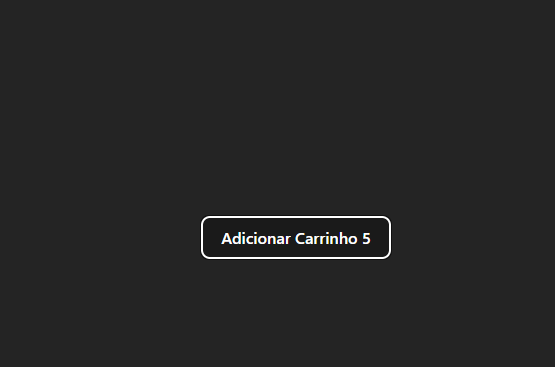
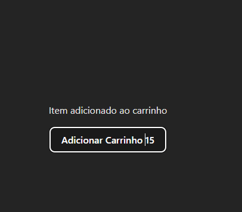

#Nesse exemplo usei o useState para controlar o status da quantidade do carrinho e a notificação a cada novo item adicionado.
#Usei também o useRef que controla o tempo que a notificação irá aparecer em tela e a cada novo clique o código mantém a referência do tempo informado e só irá desaparecer apos o tempo passado e não havendo mais cliques.

